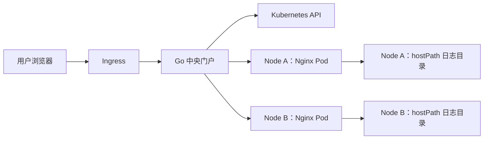

# Kubernetes 节点日志下载门户设计

## 1. 背景

应用服务将日志写入所在 Kubernetes Node 的宿主机目录。运维人员目前需要登录节点并手工定位、复制日志，操作成本高，也缺少统一入口和审计记录。

本项目提供一个轻量级 Web 门户。用户登录后选择节点、服务和日志文件，通过浏览器下载目标 Node 上的日志。

## 2. 产品目标

- 提供统一的日志下载入口。
- 支持按“节点 → 服务 → 文件”定位日志。
- 不要求用户登录 Kubernetes Node。
- 支持大文件流式下载和 HTTP Range 断点续传。
- 将宿主机文件访问限制在显式配置的日志目录内。
- 记录登录与文件下载审计日志。
- 保持部署和运行依赖轻量。

## 3. 第一版范围

### 3.1 包含

- 单一共享管理员账号登录。
- Kubernetes Node 列表和在线状态。
- 每个节点可访问的服务列表。
- 日志文件名、大小和修改时间展示。
- 文件名过滤。
- 单文件下载。
- 下载失败提示。
- 登录及下载审计。
- 管理员退出登录。

### 3.2 不包含

- 多用户、角色和细粒度权限。
- 日志内容预览、全文搜索和实时 Tail。
- 日志删除、编辑或上传。
- 多文件选择和服务端压缩。
- 日志聚合、告警和分析。
- 跨 Kubernetes 集群管理。
- 服务目录下的递归子目录浏览。

## 4. 已确认约束

- 所有 Kubernetes Node 使用相同的宿主机日志根目录。
- 目录结构固定为 `<日志根目录>/<服务名称>/<日志文件>`。
- 服务目录下直接存放日志文件，不再包含子目录。
- 日志根目录由 ConfigMap 配置，部署时可按环境指定。
- 第一版只有一个共享管理员账号。
- 系统只读访问日志，不改变宿主机文件。

目录示例：

```text
<日志根目录>/
├── order-service/
│   ├── app.log
│   └── error.log
└── payment-service/
    └── app.log
```

## 5. 方案比较与选择

### 5.1 直接暴露每个节点的 Nginx

开发量最小，但用户需要处理不同节点地址，认证、审计和访问控制薄弱，也难以形成统一产品入口，因此不采用。

### 5.2 Go 中央门户加 Nginx DaemonSet

每个 Node 上的 Nginx 只负责高效、只读地列举和传输文件；Go 门户负责认证、节点发现、路径校验、审计和统一界面。该方案符合轻量部署目标，并保留后续扩展空间。

这是第一版采用的方案。

### 5.3 自研 Go Node Agent

自研 Agent 可以提供更精细的节点侧鉴权和文件元数据，但增加开发、升级和安全维护成本。只有 Nginx 无法满足后续需求时再考虑替换。

## 6. 总体架构



用户只能访问 Go 门户。Nginx DaemonSet 不提供面向用户的独立入口。

Go 门户查询 Kubernetes API，根据 DaemonSet Pod 的 `spec.nodeName`、Pod IP 和 Ready 状态建立节点与 Nginx Pod 的映射。门户需要访问具体节点，因此不通过会随机负载均衡的普通 Service 转发文件请求。

节点与 Pod 映射通过 informer watch 维护。缓存新鲜度按“最近一次成功完成 list/relist 并提交快照，或 watch 处理到事件/BOOKMARK 并推进 resourceVersion”的时间计算；仅建立 watch 连接但未推进 resourceVersion 不刷新新鲜度。稳定集群不能依赖普通对象变更来保活，必须启用 watch bookmark 并保留周期性 relist 兜底。

## 7. 组件设计

### 7.1 Go 中央门户

Go 门户以单个二进制交付，并内嵌前端静态资源。第一版部署一个副本。

主要职责：

- 提供登录、退出和会话管理。
- 读取并校验产品配置。
- 查询 Kubernetes Node 和 Nginx DaemonSet Pod。
- 根据节点名称定位对应的 Ready Pod IP。
- 返回配置允许的服务列表。
- 请求节点 Nginx 获取文件列表。
- 对下载参数进行严格校验。
- 将文件内容以流式方式转发给浏览器。
- 输出结构化审计日志。

门户不将日志文件落盘，也不在内存中完整缓冲文件。

### 7.2 Nginx DaemonSet

DaemonSet 保证每个目标 Node 上运行一个 Nginx Pod。

主要职责：

- 将宿主机日志根目录只读挂载到容器 `/logs`。
- 使用 Nginx JSON autoindex 返回指定服务目录下的文件元数据。
- 提供静态文件下载。
- 原生处理 `Range`、`ETag`、`Last-Modified` 和流式传输。

Nginx 只监听集群内部端口，不配置 NodePort 或外部 Ingress。通过 NetworkPolicy 将入站访问限制为 Go 门户 Pod。

Nginx 以非 root 用户运行。部署环境必须保证日志根目录及允许访问的服务目录对该 UID/GID 或显式配置的 `supplementalGroups` 具备目录遍历和文件读取权限；`hostPath` 只读挂载只保证不可写，不能替代宿主机权限校验。Agent DaemonSet 必须从与门户同源的配置生成 `probe_directories.txt`，readiness 探针逐项读取 `/logs/<directory>/<probeFileName>`；任一允许目录缺失探测文件或权限不足时 Agent 不得标记 Ready。

### 7.3 配置

ConfigMap 保存非敏感配置：

```yaml
logRoot: /data/logs
services:
  - id: order-service
    displayName: 订单服务
    directory: order-service
  - id: payment-service
    displayName: 支付服务
    directory: payment-service
sessionTTL: 8h
discovery:
  staleAfter: 30s
  watchRefreshInterval: 20s
fileList:
  maxItems: 10000
  maxResponseBytes: 8MiB
download:
  bodyIdleTimeout: 60s
  maxDuration: 0
agent:
  probeFileName: .log-portal-read-probe
  probeScope: allServices
```

服务目录必须是日志根目录的直接子目录。`directory` 必须精确匹配 `^[a-z0-9][a-z0-9_-]{0,62}$`，不能包含点、斜杠、反斜杠、百分号或 URL 编码路径分隔符。

Kubernetes Secret 保存：

- 固定用户名，默认建议使用 `admin`。
- 使用 bcrypt 或 Argon2id 生成的密码哈希。
- 随机生成的会话签名密钥。

配置中不保存明文密码。

### 7.4 Kubernetes 权限

Go 门户使用专用 ServiceAccount。RBAC 仅授予：

- 获取和列出 Node。
- 获取、列出和监听部署 Nginx DaemonSet 的 Pod。

Nginx Pod 不需要访问 Kubernetes API。

## 8. 用户流程

### 8.1 登录

1. 用户打开门户登录页。
2. 用户输入共享管理员用户名和密码。
3. 门户验证密码哈希。
4. 验证成功后签发带有效期的安全会话 Cookie。
5. 门户记录登录成功或失败审计事件。

### 8.2 浏览文件

1. 页面加载 Kubernetes Node 列表。
2. 用户选择一个节点。
3. 页面展示配置允许的服务。
4. 用户选择服务。
5. 门户定位该节点对应的 Ready Nginx Pod。
6. 门户向 Nginx 请求服务目录的 JSON 文件列表。
7. 门户在限制上游响应体字节数的同时流式解析 JSON，仅保留普通文件；达到第 10,001 项、响应体超限或 JSON 非法时立即取消上游请求并返回稳定业务错误。
8. 用户可以按文件名过滤结果。

### 8.3 下载

1. 用户点击文件的下载按钮。
2. 门户重新验证会话、节点、服务和文件名。
3. 门户确认目标节点 Nginx Pod 仍处于 Ready 状态。
4. 门户向 Nginx 发起文件请求，转发浏览器的合法 Range 请求，并显式请求 `Accept-Encoding: identity`、禁用 Go Transport 自动解压，保持 Range、Content-Length 和 Content-Range 语义一致。
5. 门户将 Nginx 响应流直接传给浏览器，并用 `bodyIdleTimeout` 进展看门狗防止上游或客户端连续无字节进展时长期占用连接和并发槽。
6. 门户记录下载结果、响应状态和传输字节数。

文件可能在列表展示后被轮转或删除。此时下载返回“文件已不存在”，不尝试查找名称相近的替代文件。

## 9. 页面设计

第一版提供三个页面状态：

- 登录页。
- 日志下载主页面。
- 未授权或系统错误状态页。

主页面采用清晰的顺序选择：

1. 节点选择器，展示 Ready、NotReady 或日志代理不可用状态。
2. 服务选择器。
3. 文件列表。

文件列表展示：

- 文件名。
- 文件大小。
- 最后修改时间。
- 下载操作。

页面提供文件名过滤和手动刷新。页面不显示宿主机真实绝对路径、Nginx Pod IP 或内部下载地址。

## 10. 接口边界

门户对浏览器提供以下逻辑接口：

```text
POST /api/v1/login
POST /api/v1/logout
GET  /api/v1/session
GET  /api/v1/nodes
GET  /api/v1/nodes/{node}/services
GET  /api/v1/nodes/{node}/services/{service}/files
GET  /api/v1/nodes/{node}/services/{service}/files/{filename}/download
```

接口不接受宿主机绝对路径。节点、服务和文件名都使用单独的逻辑参数，并在解码后再次验证。

节点参数使用 Kubernetes DNS-1123 subdomain 规则校验，最大 253 字节，并与 informer 快照中的 Node 名称精确匹配；不使用最大 63 字节的 DNS label 规则。节点响应同时包含 `nodeReady`、`agentReady`、派生 `status` 和可选 `reason`：`agentReady=false` 是文件列表与下载的硬阻断；`nodeReady=false` 但 `agentReady=true` 只作为风险提示，允许用户尝试读取日志。

每个响应携带最终 `X-Request-ID`。门户只接受 `^[A-Za-z0-9_-]{1,64}$` 的客户端请求 ID；缺失或非法时生成新的 UUID/ULID，并在运行日志与审计日志中使用同一值。

## 11. 安全设计

- `hostPath` 必须以只读方式挂载，并在发布前验证非 root Agent 对目录具有遍历权限、对普通日志文件具有读取权限。
- 门户和 Nginx 容器使用只读根文件系统，并以非 root 用户运行。
- Nginx 不暴露集群外入口。
- NetworkPolicy 只允许门户访问 Nginx；若同 namespace 存在非可信 Pod 创建权限，必须用独立 namespace、准入策略或 mTLS/服务网格身份避免标签冒充。
- 只允许访问 ConfigMap 白名单中的服务目录。
- 只允许下载服务目录下的普通文件。
- 文件名必须是 NFC-stable UTF-8 单一名称，1–255 字节，且不是 `.` 或 `..`；拒绝残留 `%`、路径分隔符、控制字符、双重编码、编码斜杠和空字节。文件列表与下载复用同一校验实现，不做大小写折叠、相近名称查找或 Unicode 宽松匹配。
- 拒绝符号链接，防止跳出允许目录。
- Cookie 设置 `HttpOnly`、`Secure` 和合适的 `SameSite` 属性。
- 登录接口限制失败次数和请求频率。
- 使用恒定时间的安全密码校验库。
- 所有外部响应隐藏内部 Pod IP、真实路径和底层错误细节。
- 下载响应设置 `Content-Disposition: attachment` 和安全的文件名。
- 默认 CSP 至少包含 `default-src 'self'; script-src 'self'; style-src 'self'; img-src 'self'; connect-src 'self'; form-action 'self'; object-src 'none'; base-uri 'none'; frame-ancestors 'none'`。
- Ingress 强制 HTTPS。

## 12. 审计

第一版不引入数据库。门户将 JSON 结构化审计事件写入标准输出，由现有 Kubernetes 日志系统采集。

登录事件包含：

- 时间。
- 事件类型。
- 用户名。
- 客户端 IP。
- 成功或失败。
- 失败原因分类。

下载事件包含：

- 时间。
- 用户名。
- 客户端 IP。
- 节点。
- 服务。
- 文件名。
- HTTP 状态。
- 传输字节数。
- 请求耗时。

审计日志不记录密码、Cookie、文件内容或其他敏感凭据。审计时间统一使用 UTC RFC3339Nano；平台日志系统保留期不少于 180 天，并限制普通应用覆盖或删除审计日志的权限；节点时钟漂移超过 2 秒应告警。

## 13. 错误处理

- 未登录或会话失效：返回 401，并引导重新登录。
- 参数不合法或命中路径保护：返回 400；安全审计中记录拒绝事件。
- 服务不在白名单：返回 404，避免泄露配置。
- 节点不存在：返回 404。
- 节点无 Ready Nginx Pod：返回 503，并显示“节点日志代理不可用”。
- 文件已删除或轮转：返回 404。
- 文件列表超过 `maxItems` 或 `maxResponseBytes`：立即终止上游请求，返回 413 和 `FILE_LIST_TOO_LARGE`。
- 节点 Nginx 连接、响应头或正文连续无字节进展超时：返回 504，并释放并发槽。
- Nginx 返回 403、非预期 5xx、重定向、Range 请求返回 200、畸形 JSON 或非法响应头：返回 502，并记录不含内部地址的 `UPSTREAM_ERROR`。
- 下载中途断开：终止上游请求并记录未完成状态。
- Kubernetes API 暂时不可用：返回 503；已建立的下载流不主动中断。

所有错误响应携带请求 ID，便于关联门户运行日志和审计日志。

## 14. 性能与可用性

- 文件内容使用固定大小缓冲区流式传输，内存占用不随文件大小线性增长；下载复制循环必须实现连续无字节进展超时，避免上游或客户端空转长期占用资源。
- 文件列表使用有字节上限的流式 JSON 解码，不将无界 autoindex 响应完整载入内存。
- Nginx 原生支持 HTTP Range；门户保留必要的范围响应头。
- 下载并发数、上游连接超时、正文空转超时和传输限速可通过配置调整。
- 节点和 Pod 映射使用短期缓存，并通过 Kubernetes watch 的事件/BOOKMARK 与周期性 relist 更新。
- 第一版单副本门户避免共享会话状态问题。
- 门户重启会使现有会话失效，用户重新登录即可恢复，不影响节点日志。
- 某个节点不可用不影响其他节点的浏览和下载。
- Ingress 必须按实际控制器关闭响应缓冲和临时文件落盘，允许长连接并设置覆盖最大文件下载时长的读写超时；1 GB 以上验收必须从集群外经 HTTPS Ingress 完整执行，不能只测试 Portal Pod。

如果未来下载量使中央门户成为带宽瓶颈，可在保持认证接口不变的情况下，演进为受控的短期签名直链；该能力不属于第一版。

## 15. 测试策略

### 15.1 单元测试

- 配置解析和服务白名单。
- 文件名、节点名和服务参数验证。
- 路径穿越及多重 URL 编码攻击样例。
- 密码校验、登录限流和会话过期。
- Nginx autoindex JSON 转换。
- autoindex JSON 流式解码、响应体字节上限和第 10,001 项提前终止。
- Range 请求头和响应头转发。
- `Accept-Encoding: identity` 与自动解压关闭后的 Range/长度头一致性。
- `Content-Range`、`Content-Length`、Range 请求返回 200 和下载正文空转超时。
- `X-Request-ID` 接收、拒绝非法值和自动生成。
- 错误状态映射。

### 15.2 集成测试

- 使用模拟 Kubernetes API 验证 Node 与 Pod 映射。
- 验证稳定集群在超过 `staleAfter` 无 Node/Pod 变更时仍通过 BOOKMARK 或 relist 保持可用；验证 watch 连接建立但未推进 resourceVersion 不刷新新鲜度，以及 watch/relist 失败后按新鲜度窗口转为 503。
- 使用测试 Nginx 验证文件列表、完整下载和分段下载。
- 验证文件在列出后删除或轮转的行为。
- 验证上游超时、正文空转和中途断开。
- 验证审计字段完整、UTC 时间、留存策略且不包含敏感信息。

### 15.3 部署验证

- 在至少两个 Node 上验证 DaemonSet 各运行一个 Pod。
- 验证每个 Pod 只能读取所在 Node 的日志。
- 验证挂载目录和容器根文件系统不可写。
- 验证非 root Agent 对允许目录可遍历、对 `probeFileName` 可读，缺失探测文件或权限不足时 readiness 或发布检查失败。
- 验证浏览器无法直接访问 Nginx。
- 验证 NetworkPolicy 阻止其他工作负载访问 Nginx。
- 验证非可信命名空间不能通过伪造 Portal 标签访问 Agent；若共享命名空间无法保证，必须启用准入限制、独立命名空间或 mTLS。
- 从集群外经 HTTPS Ingress 验证 1 GB 以上文件的内存稳定性、无 Ingress 临时文件落盘和断点续传。

## 16. 验收标准

- 用户能通过统一 Web 入口登录。
- 用户能按节点、服务、文件完成日志定位和下载。
- 所有 Node 使用统一目录规则，无需逐节点配置路径。
- 1 GB 以上文件能够流式下载，门户内存不会按文件大小增长。
- 1 GB 以上文件从集群外经 HTTPS Ingress 下载时不发生 Ingress 响应缓冲或临时文件落盘。
- 浏览器中断后能够通过 HTTP Range 继续下载。
- 上游或客户端连续无字节进展时下载会按 `bodyIdleTimeout` 取消，并释放并发槽。
- 超大 autoindex 响应不会被完整载入内存，并在字节或条目上限处终止。
- 非 root Agent 在发布前已验证可遍历允许目录并读取 `probeFileName`；缺失探测文件或权限不足时不会 Ready。
- 用户无法访问白名单服务之外的目录或文件。
- 用户无法通过路径编码、符号链接或文件名构造逃逸日志根目录。
- 一个节点不可用时，其他节点仍可正常使用。
- 登录、下载和安全拒绝行为都产生完整且不含敏感信息的审计记录；UTC 时间、留存、不可覆盖/删除权限和 requestId 关联均可验证。
- 系统不要求部署业务数据库。

## 17. 后续演进

按实际需求选择性增加：

- 多用户和基于服务的权限控制。
- 对接企业 OIDC/SSO。
- 多文件打包下载。
- 多集群切换。
- 在线查看文件尾部内容。
- 短期签名直链，降低中央门户下载带宽。

这些演进不改变第一版的节点日志目录约定。
